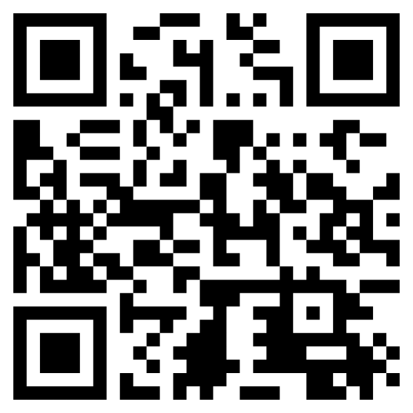
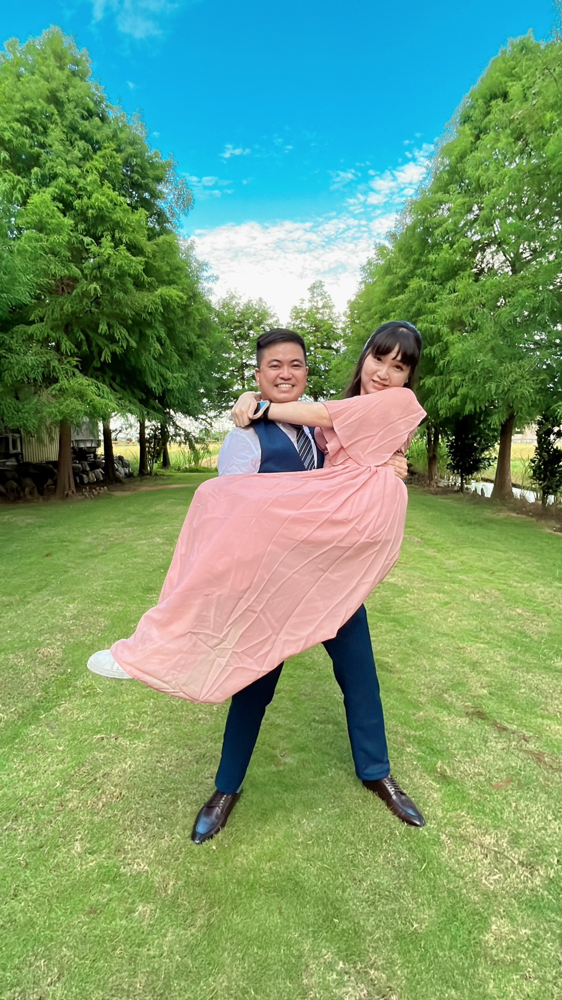

# 自我介紹QRcode

# 簡歷

|項次 | 項目 |內容 |
|---:|------|------|
|1 | 生活照 | 
|2 |姓名 |施志傑 |
|3 | 職稱 | 品保工程師 |
|3 | 任職公司 | 潤泰精密材料(股)公司 |

  
## 我最喜愛的一首歌

楊培安-我相信  
這首歌能在隨時隨地帶給我滿滿的動力

 影片取自 youtube

## 平時興趣

 
  
|室內活動	| 室外活動 | 
|-----------|------------|
| 聽音樂、唱歌、 看影片、讀小說| 逛展覽、打羽毛球|

